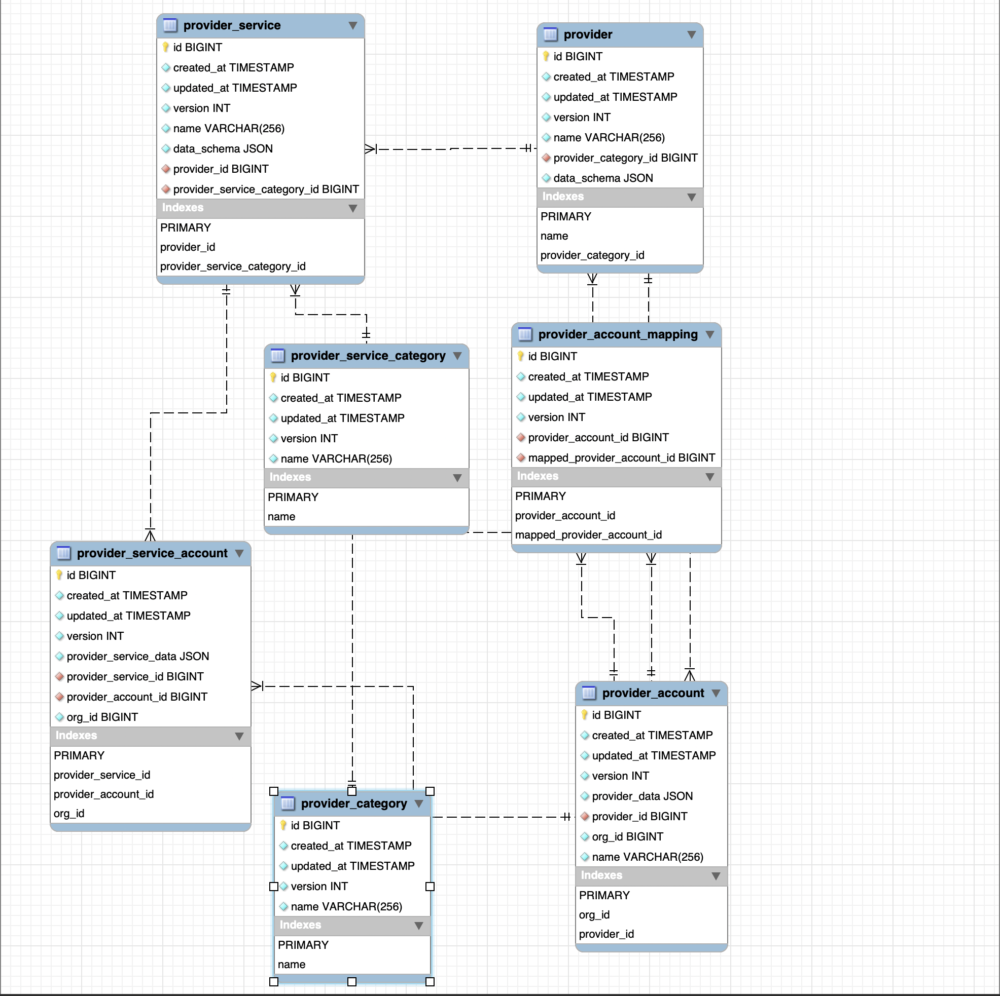

# Odin Account Manager

Odin Account Manager is a gRPC application server that hosts data for cloud accounts like AWS, GCP, and other provider services. This documentation provides a comprehensive overview of the database schema and API usage.

## Schema Entities

The system is built around a hierarchical structure with the following core entities:

1. **[Provider Category](./docs/provider-category.md)** - Top-level classifications for organizing providers (CLOUD, ARTIFACTORY, MONITORING, etc.)
2. **[Provider](./docs/provider.md)** - Specific providers within categories like AWS, GCP, JFrog with their data schemas
3. **[Provider Account](./docs/provider-account.md)** - Instances of providers with specific configurations (e.g., AWS Production Account)
4. **[Provider Service Category](./docs/provider-service-category.md)** - Classifications for organizing provider services (KUBERNETES, VM, STORAGE, etc.)
5. **[Provider Service](./docs/provider-service.md)** - Specific services within providers (EC2, S3, EKS, etc.)
6. **[Provider Service Account](./docs/provider-service-account.md)** - Instances of services linked to provider accounts

### Entity Relationships



## API Services

The system exposes two main gRPC services:

### 1. Provider Account Service
- **Package**: `dream11.oam.provideraccount.v1`
- **Service**: `ProviderAccountService`
- **Port**: `8080` (default)

**Available Operations**:
- Get Provider Account(s)
- Get All Provider Accounts
- Create Provider Category
- Create Provider
- Create Provider Account

### 2. Provider Service Account Service
- **Package**: `dream11.oam.psa.v1`
- **Service**: `ProviderServiceAccountService`
- **Port**: `8080` (default)

**Available Operations**:
- Get Provider Service Account
- Create Provider Service Category
- Create Provider Service
- Create Provider Service Account

## Quick Start

### Prerequisites
- Server running on `localhost:8080`
- `grpcurl` installed for API testing
- Organization ID (default: `1`)

### Basic Usage Example

```bash
# Health check
grpcurl -plaintext localhost:8080 grpc.health.v1.Health/Check

# Get all provider accounts
grpcurl -plaintext \
  -H "orgId: 1" \
  -d '{"fetch_linked_account_details": false}' \
  localhost:8080 \
  dream11.oam.provideraccount.v1.ProviderAccountService/GetAllProviderAccounts
```

## Additional Resources

- [Database Migrations](./src/main/resources/db/mysql/migrations/)
- [Seed Data](./src/main/resources/db/mysql/seed/)
- [Proto Definitions](./src/main/proto/)
